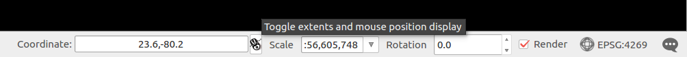

# Working with CoreLogic Data

Because the Tax Assessor, Deed sales, and Foreclosure data are each presented in a single large text file, it can be difficult to work with just the state(s), count(ies), or citi(es) that you're interested in.
Even very large text files can be manipulated easily as text streams on a Unix-like operating system, hwoever.

## Tax Assessor Data

Because some of the rows in the Tax Assessor data **have no SITUS State code (e.g., "MI")**, if you want to make sure you're not missing any parcels whatsoever, you should filter on FIPS codes instead of on the SITUS State codes.

### Filtering and Extracting Data Subsets

#### By County

The Tax Assessor data have a handy FIPS code field for counties.
A private company, Scientific Telephone Samples, maintains [a list of all U.S. counties and their FIPS codes](http://www.stssamples.com/county-fips.asp); you can consult this list to find the FIPS code(s) for the count(ies) you're interested in.
[There's also a list available from the Bureau of Economic Analysis](https://www.bea.gov/regional/docs/msalist.cfm) (FIPS codes are in the third column of this spreadsheet).
Then, you can filter the FIPS code field (1st column of the text file) for entries that match these code(s) you're intersted in.

```sh
# Example: For Los Angeles or Orange counties
awk -F "|" '{ if ($1 == 06037 || $1 == 06059) print }' Michigan_Uni_Tax_AKZA_85HRQ5.txt > filtered_sample.txt
```

#### By Bounding Box

If you have a study area in mind that isn't encompassed by municipal, county, or state boundaries (e.g., parcels within a certain distance of X), you can do a bounding-box search just as easily.
A bounding box is a rectangular area defined by the bottom-left and upper-right coordinates, e.g., two latitude-longitude pairs.
You can get a bounding box [easily in QGIS](http://www.qgis.org/en/site/) by clicking on the button to the right of the "Coordinates" box in the bottom toolbar.
See the image below for an example.



A bounding box query looks similar to our previous `awk` queries.
In this example, the bounding box from QGIS shows `-83.84,42.00 : -82.53,42.92`, which means that our `awk` query should be:

```sh
# Extract those records located in the Detroit metro area:
gawk -F "|" '{ if ($31 >= 42 && $31 <= 42.92 && $32 >= -83.84 && $32 <= -82.53) print }' Michigan_Uni_Tax_AKZA_85HRQ5.txt > filtered_sample.txt
```
